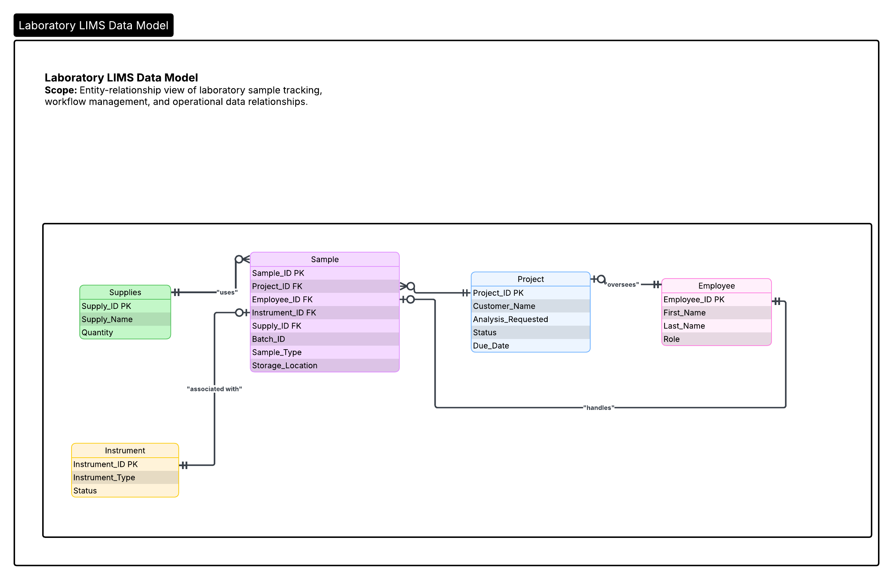

# Laboratory LIMS Database

## Recruiter Summary

A relational Oracle SQL database designed from laboratory business requirements to model sample tracking, workflow management, audit logging, and structured data access in a simulated regulated laboratory environment.

This project demonstrates requirements-driven relational database design, sample traceability, metadata management, automated key generation, audit tracking, query abstraction, and data integrity controls for laboratory operations.

## Entity Relationship Diagram

## What This Project Demonstrates

* Translating laboratory business requirements into a relational database schema
* Designing tables from defined entities, attributes, relationships, and business rules
* Modeling laboratory workflows involving projects, samples, instruments, employees, and supplies
* Enforcing primary key and foreign key relationships for data integrity
* Using Oracle sequences for automated key generation
* Implementing triggers for audit tracking and record management
* Creating views to simplify access to structured laboratory data
* Applying indexes to support common query patterns

## System Context

This database models a laboratory information management system for a simulated environmental testing laboratory. The system replaces handwritten tracking logs with structured database records for samples, projects, instruments, employees, and supplies.

The design focuses on traceability, auditability, workflow status tracking, and data consistency across laboratory operations.

## Requirements-Driven Design

The schema was built from a defined requirements document specifying entities, attributes, relationship cardinality, and workflow constraints.

The resulting implementation includes one-to-many and one-to-one relationships across laboratory entities, with business rules supporting sample assignment, instrument usage, project oversight, supply usage, and employee handling.

## Data Model Overview

Core entities include:

* **Projects** — laboratory testing requests and workflow status
* **Samples** — biological or environmental materials linked to projects and batches
* **Instruments** — laboratory equipment used for sample analysis
* **Employees** — operational users and laboratory roles
* **Supplies** — materials used for sample preparation and analysis

Key relationships include:

* A project can contain multiple samples
* A sample belongs to one project
* A sample can be associated with instrument processing activity
* Employees are linked to sample handling and project oversight
* Supplies support sample preparation and analysis workflows

## Core System Features

### Relational Schema Design

The database uses normalized relational tables with primary and foreign key constraints to maintain consistency across laboratory entities.

### Automated Key Management

Oracle sequences generate consistent surrogate keys across core tables.

### Audit Tracking

Triggers support automatic tracking of record creation, modification timestamps, and user attribution.

### Query Abstraction

Views provide simplified access to structured data for common workflow entities, including projects, samples, instruments, employees, and supplies.

### Indexing

Indexes support frequently accessed query paths, including batch-level sample tracking, foreign key joins, and workflow-related lookups.

## Example Workflow

A typical usage flow:

1. A project is created for a laboratory testing request.
2. Samples are registered under the project and assigned batch identifiers.
3. Samples are associated with preparation, storage, or analysis status.
4. Instruments and employees are linked to workflow activity.
5. Data is queried through structured views for downstream review, reporting, and operational tracking.

## Example Outputs

The database implementation includes validation queries showing:

* Created tables, views, indexes, sequences, and triggers
* Employee and instrument records
* Active instrument views
* Project and sample tracking records
* Supply reorder queries
* Transaction rollback and commit behavior

## Technology Stack

**Oracle SQL** • **Relational Database Design** • **Sequences** • **Triggers** • **Views** • **Indexes**

## Design Goals

This project emphasizes:

* Traceable sample and workflow state management
* Structured relational data modeling
* Auditability for operational records
* Data integrity across laboratory entities
* Translation of business requirements into database implementation
* Compatibility with downstream QC, review, and reporting workflows

## Future Enhancements

* ERD/schema diagram
* Sample query output examples
* REST API layer for programmatic database access
* Expanded role-based access control
* Additional schema normalization review

## Author

**Shiloh Cadere**
Bioinformatics Analyst specializing in genomics QC, data validation, workflow traceability, and laboratory data systems.
